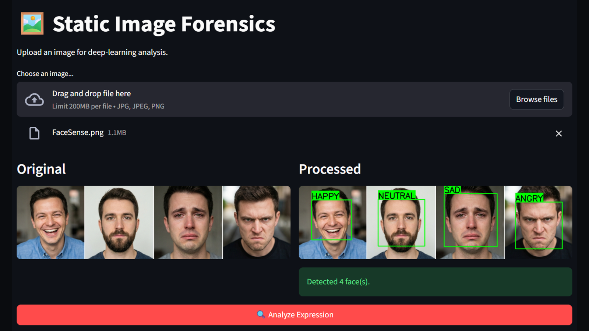
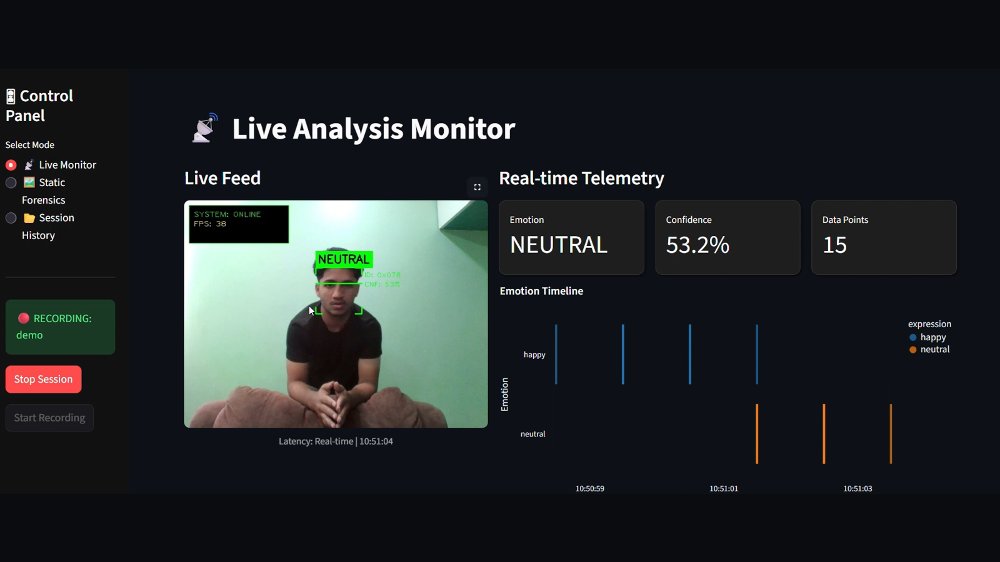
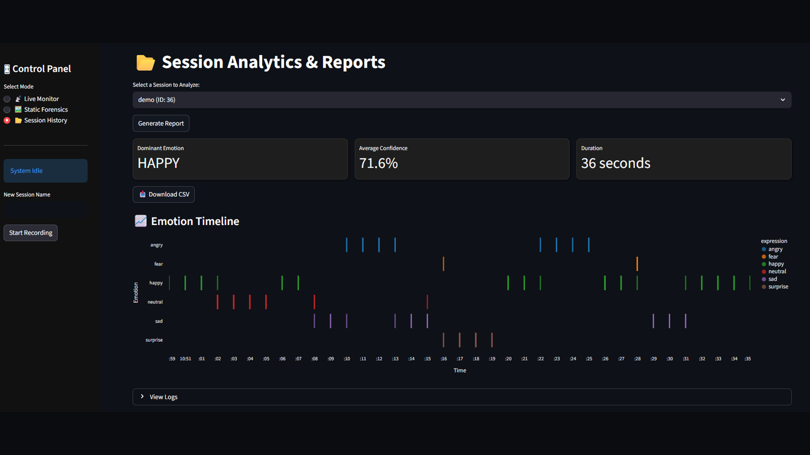

# 🎭 FaceSense – End-to-End Emotion Recognition System

    

**FaceSense** is a full-stack computer vision application designed to analyze, log, and visualize human facial expressions in real-time. It goes beyond simple detection by integrating a robust analysis pipeline for real-world use cases.

---

## 💡 Use Case Scenarios
Imagine installing this system in a **Movie Theater**, where instead of relying on written reviews, studios can analyze audience reactions in real-time—identifying exactly when the crowd laughed, cried, or gasped. Other potential applications include:

- **Education:** Monitoring engagement levels in classrooms.
- **Retail:** Measuring customer satisfaction in stores.
- **Personal Devices:** Smart assistants with emotion recognition.

---

## 🚀 Key Features

### 1. Real-Time Inference Engine (`live.py`)
- **Deep Learning Integration:** Utilizes **DeepFace** (TensorFlow/Keras) for emotion classification.
- **Custom Stabilization:** Employs a **Rolling Vote Buffer (Deque)** to prevent label flickering and ensure stability.
- **"Highlander" Logic:** Filters false positives ("Ghost Faces") using dynamic bounding box calculations.
- **Sci-Fi inspired UI:** Displays dynamic confidence bars, scanning lasers, and real-time FPS telemetry using OpenCV.

### 2. Intelligent Data Logging
- **Concurrency Management:** Solves high-speed video writing "Race Conditions" with a non-blocking architecture.
- **Session Management:** Prevents "Data Pollution" by ensuring data logging is limited to active sessions initiated via the dashboard.

### 3. Analytics Dashboard (`facesense_dashboard.py`)
- **Interactive UI:** Real-time data visualization using **Streamlit**.
- **Forensic Analysis:** View breakdowns of "Dominant Emotions" and historical trends.
- **Remote Monitoring:** Access live webcam feeds from the dashboard interface.

---
## 🔍 Static Image Forensics


## 🎥 Live Emotion Analysis


## 📊 Session Analytics & Reports



## 🛠️ Tech Stack
- **Programming Language:** Python 3.x
- **Computer Vision:** OpenCV (`cv2`)
- **AI Model:** DeepFace (FER2013 weights)
- **Database:** MySQL (Connector/Python)
- **Visualization Tools:** Streamlit, Altair, Pandas
- **Data Processing:** NumPy

---

## ⚙️ Installation

### Step 1: Clone the Repository
```bash
git clone https://github.com/senseofomar/FaceSense.git
```

### Step 2: Set Up Virtual Environment
```bash
python -m venv .venv

# Activate the Environment
# For Windows:
.venv\Scripts\activate
# For Mac/Linux:
source .venv/bin/activate
```

### Step 3: Install Dependencies
```bash
pip install -r requirements.txt
```

### Step 4: Database Setup (MySQL)
1. Create a database named `facesense_db`.
2. Run the following SQL commands to set up the required tables:
```sql
CREATE TABLE sessions (
    id INT AUTO_INCREMENT PRIMARY KEY,
    session_name VARCHAR(255),
    start_time TIMESTAMP DEFAULT CURRENT_TIMESTAMP,
    is_active BOOLEAN DEFAULT 1
);

CREATE TABLE emotion_logs (
    id INT AUTO_INCREMENT PRIMARY KEY,
    session_ref_id INT,
    expression VARCHAR(50),
    confidence FLOAT,
    x1 INT, 
    y1 INT, 
    x2 INT, 
    y2 INT,
    timestamp TIMESTAMP DEFAULT CURRENT_TIMESTAMP,
    FOREIGN KEY (session_ref_id) REFERENCES sessions(id)
);
```

### Step 5: Configure Database Connection
Update the `facesense/storage/db.py` file with your MySQL credentials:
```python
def get_connection():
    return mysql.connector.connect(
        host="localhost",
        user="your_user",
        password="your_password",
        database="facesense_db"
    )
```

### Step 6: Start the Application
#### Start the Dashboard
Run the following command to launch the dashboard for session management and visualization:
```bash
streamlit run app/facesense_dashboard.py
```

#### Start the Camera Feed
Run the camera feed for AI inference:
```bash
python facesense/apps/live.py
```
> *Press 'q' to quit the camera interface.*

---

## 🧠 Challenges Solved

### Ghost Face Detection
Haar Cascades often detect shadows and other artifacts as faces. This issue is mitigated with dynamic size-filtering logic to focus exclusively on primary subjects.

### Race Conditions in File Locking
The system implements a Retry-with-Fallback mechanism to maintain smooth video feed writing (30 FPS) while the dashboard simultaneously reads frames.

---

## 🤝 Contributing
We welcome your ideas and feedback! If you have suggestions for additional use cases (e.g., retail analytics, online education monitoring), feel free to open an issue or pull request.

---

## 👤 Author
This project is developed and maintained by **senseofomar**. For any queries, please reach out via the repository.


